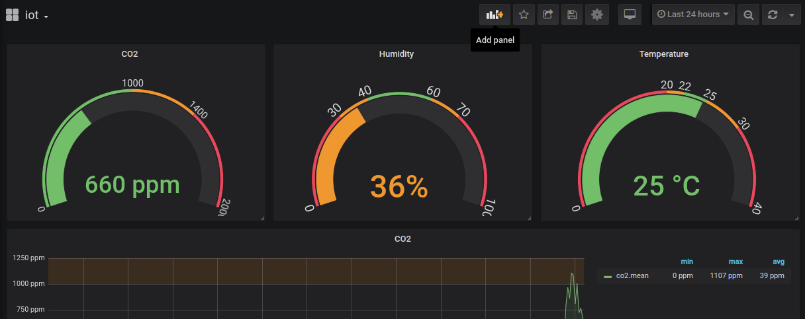
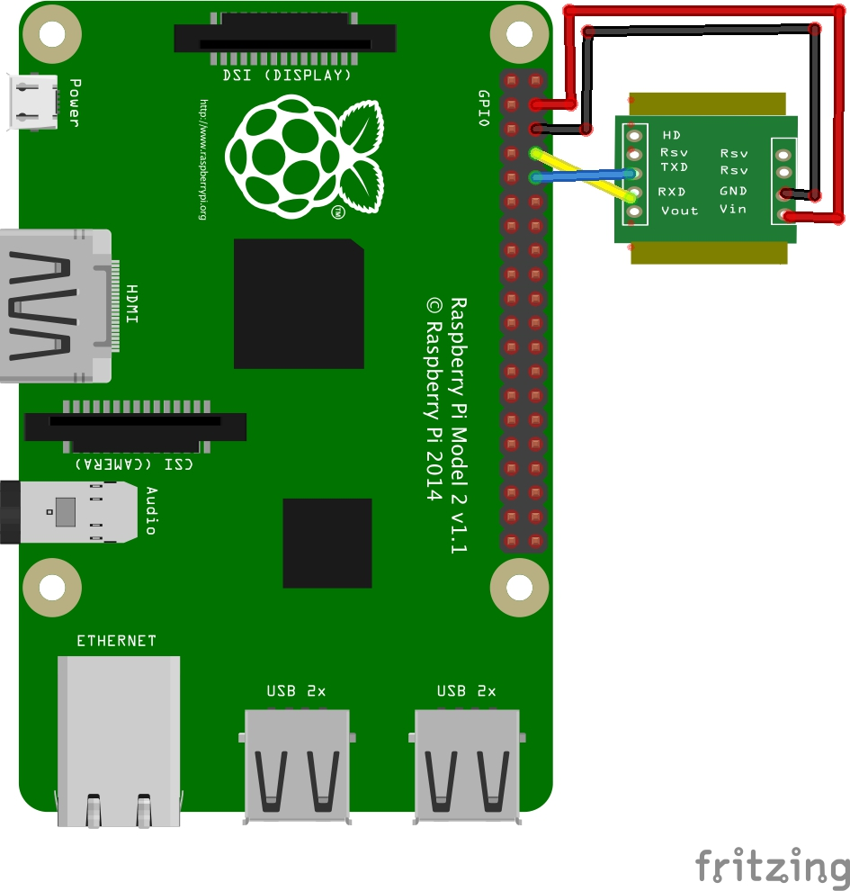
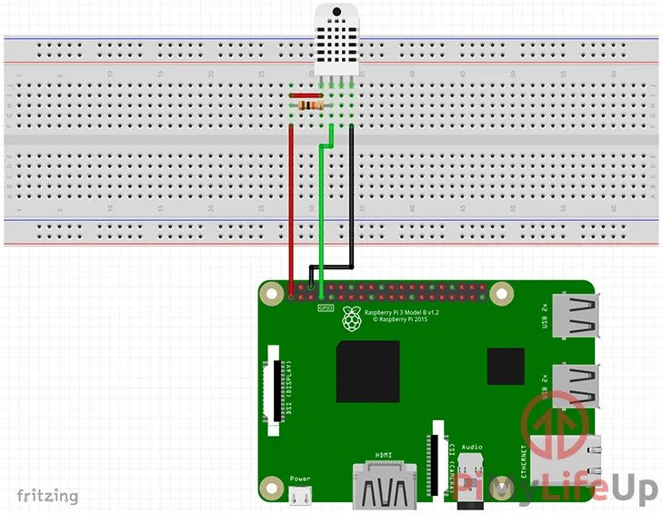

# Quick setup CO2/Humidity/Temperature monitoring system with grafana dashboard on Raspberry Pi (DHT22 and MH-Z19 sensors)

- Connect DHT22 sensor:
  
  [Instruction](https://pimylifeup.com/ "Instruction")
- Connect MH-Z19 sensor:
  
  
  [Instruction](https://monitorserviceatelierueda.blogspot.com/2018/11/how-to-measure-room-co2-concentration.html "Instruction")
- For reading from MH-Z19:

  * Add the line "enable_uart=1" to the '/boot/config.txt' file
  * Remove the phrase "console=serial0,115200" from the '/boot/cmdline.txt' file
  * Reboot Pi.

- Install Docker:

  `curl -sSL https://get.docker.com | sh`

  `sudo usermod -aG docker $USER`

  reboot or logout

- Install Docker-compose:
  `pip3 install docker-compose`

- Clone this repo and change *.env* file. App uses telegram for alert notifications. Create new telegram bot ([instruction](https://docs.microsoft.com/en-us/azure/bot-service/bot-service-channel-connect-telegram?view=azure-bot-service-4.0)) and paste your token and your chat_id in *.env* file:

  `BOT_TOKEN=YOUR_TOKEN`
  
  `BOT_CHAT=YOUR_CHAT_ID`

- Run:

  `docker-compose up`

- When everything is running go to http://localhost:3000/ and use login/pass: admin/admin. Choose "iot" dashboard.
